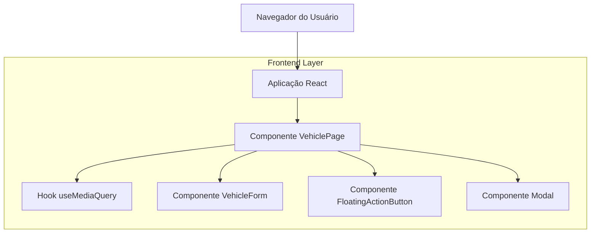

## 1. Arquitetura do Sistema



## 2. Tecnologias Utilizadas

- Frontend: React@18 + TypeScript + TailwindCSS@3
- Ferramenta de Inicialização: vite-init
- Backend: Nenhum (apenas frontend)
- Gerenciamento de Estado: React Hooks (useState, useEffect)
- Bibliotecas Adicionais:
  - Framer Motion (animações do modal)
  - React Aria (acessibilidade)

## 3. Definições de Rotas

| Rota | Propósito |
|------|-----------|
| /vehicles | Página principal de gerenciamento de veículos |
| /vehicles/new | Formulário para novo veículo (desktop) |
| /vehicles/edit/:id | Formulário para editar veículo (desktop) |

## 4. Componentes e APIs

### 4.1 Componentes Principais

```typescript
interface VehicleFormProps {
  vehicle?: Vehicle;
  onSubmit: (data: VehicleFormData) => void;
  onClose?: () => void;
}

interface ModalProps {
  isOpen: boolean;
  onClose: () => void;
  children: React.ReactNode;
  title: string;
}

interface FloatingActionButtonProps {
  onClick: () => void;
  'aria-label': string;
}
```

### 4.2 Hook Customizado

```typescript
interface UseMediaQueryReturn {
  isMobile: boolean;
  isTablet: boolean;
  isDesktop: boolean;
}

function useMediaQuery(): UseMediaQueryReturn
```

## 5. Estrutura de Arquivos

```
src/
├── components/
│   ├── VehicleForm.tsx
│   ├── VehicleList.tsx
│   ├── FloatingActionButton.tsx
│   ├── Modal.tsx
│   └── ResponsiveVehicleLayout.tsx
├── hooks/
│   ├── useMediaQuery.ts
│   └── useModal.ts
├── utils/
│   └── breakpoints.ts
└── pages/
    └── VehiclesPage.tsx
```

## 6. Implementação de Responsividade

### 6.1 Breakpoints CSS

```css
/* Mobile First Approach */
/* Mobile: 320px - 767px */
@media (max-width: 767px) {
  .vehicle-form-sidebar {
    display: none;
  }
  
  .fab-button {
    position: fixed;
    top: 16px;
    right: 16px;
    z-index: 1000;
  }
}

/* Tablet: 768px - 1023px */
@media (min-width: 768px) and (max-width: 1023px) {
  .vehicle-form-sidebar {
    width: 320px;
  }
}

/* Desktop: 1024px+ */
@media (min-width: 1024px) {
  .vehicle-form-sidebar {
    width: 400px;
  }
}
```

### 6.2 Lógica de Renderização Condicional

```typescript
const ResponsiveVehicleLayout: React.FC = () => {
  const { isMobile } = useMediaQuery();
  const [isModalOpen, setIsModalOpen] = useState(false);
  
  return (
    <div className="vehicle-page">
      <VehicleList />
      
      {isMobile ? (
        <>
          <FloatingActionButton 
            onClick={() => setIsModalOpen(true)}
            aria-label="Adicionar novo veículo"
          />
          <Modal 
            isOpen={isModalOpen}
            onClose={() => setIsModalOpen(false)}
            title="Adicionar Veículo"
          >
            <VehicleForm onSubmit={handleSubmit} onClose={() => setIsModalOpen(false)} />
          </Modal>
        </>
      ) : (
        <aside className="vehicle-form-sidebar">
          <VehicleForm onSubmit={handleSubmit} />
        </aside>
      )}
    </div>
  );
};
```

## 7. Acessibilidade

### 7.1 Atributos ARIA
- Botão FAB: `aria-label="Adicionar novo veículo"`, `role="button"`
- Modal: `role="dialog"`, `aria-modal="true"`, `aria-labelledby="modal-title"`
- Overlay: `role="presentation"`, `aria-hidden="true"`

### 7.2 Navegação por Teclado
- Tab: Navegação entre elementos focáveis
- Shift+Tab: Navegação reversa
- ESC: Fecha modal
- Enter/Space: Ativa botões e controles

### 7.3 Focus Management
- Focus trap dentro do modal
- Retorno do foco ao elemento que abriu o modal
- Indicadores visuais de foco com outline contrastante