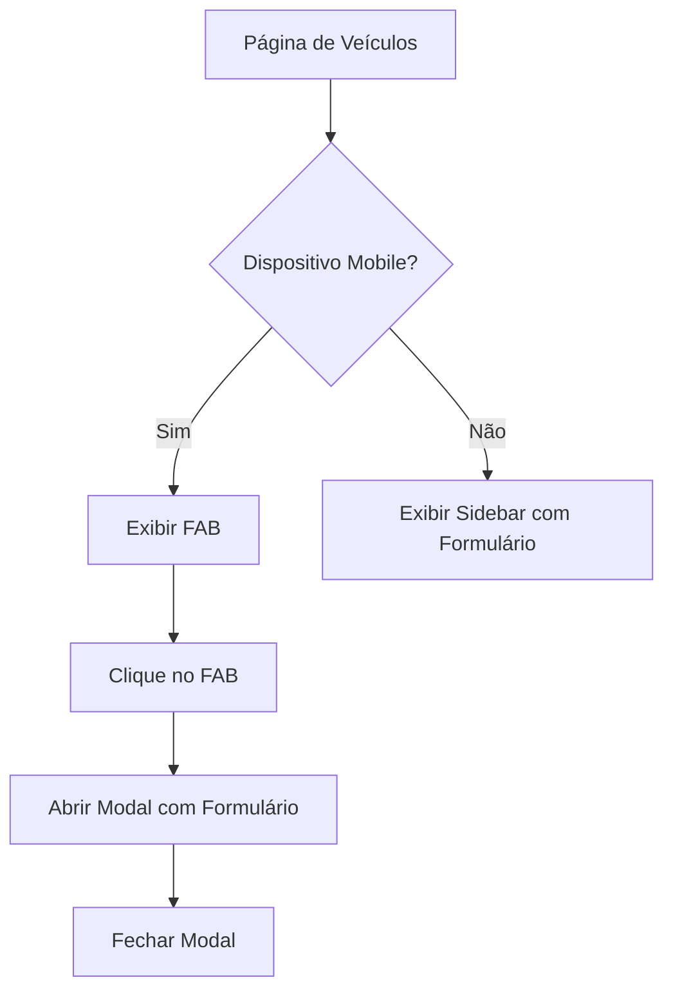

## 1. Visão Geral do Produto

Transformar a página de gerenciamento de veículos em um layout totalmente responsivo, garantindo experiência consistente em todos os dispositivos. O foco é adaptar o formulário de veículos para dispositivos móveis através de um botão flutuante que abre modal.

## 2. Funcionalidades Principais

### 2.1 Páginas e Módulos

**Página de Veículos**: Lista de veículos + Formulário de cadastro/editação

### 2.2 Detalhamento das Funcionalidades

| Página | Módulo | Descrição da Funcionalidade |
|--------|---------|----------------------------|
| Página de Veículos | Lista de Veículos | Exibir tabela/grid com veículos cadastrados |
| Página de Veículos | Formulário de Veículos | Campos para cadastrar/editar veículos (modelo, marca, ano, placa, etc) |
| Página de Veículos | Botão Flutuante (Mobile) | FAB fixo no canto superior direito para abrir modal com formulário |
| Página de Veículos | Modal de Formulário | Container modal que exibe o formulário de veículos em dispositivos móveis |

## 3. Fluxo de Navegação

## 4. Design de Interface

### 4.1 Estilo Visual
- **Cores Primárias**: Azul para elementos principais, cinza para backgrounds
- **Botão Flutuante**: Circular com ícone "+" ou "adicionar", sombra sutil
- **Modal**: Fundo branco, bordas arredondadas, overlay escuro semi-transparente
- **Animações**: Fade-in/fade-out suaves (300ms)

### 4.2 Elementos por Tamanho de Tela

| Tamanho de Tela | Layout | Elementos |
|----------------|---------|-----------|
| Mobile (320px-768px) | Coluna única | FAB no canto superior direito, modal com formulário |
| Tablet (768px-1024px) | Sidebar compacta | Formulário em sidebar lateral |
| Desktop (>1024px) | Sidebar expandida | Formulário visível ao lado da lista |

### 4.3 Responsividade
- **Mobile-first**: Design prioritário para dispositivos móveis
- **Breakpoints**: 320px, 768px, 1024px
- **Touch-friendly**: Botões com área mínima de 44x44px

### 4.4 Acessibilidade
- **ARIA Labels**: Botão FAB com aria-label="Adicionar novo veículo"
- **Modal**: aria-modal="true", role="dialog"
- **Navegação por Teclado**: Tabindex apropriado, focus trap no modal
- **Fechamento**: ESC fecha modal, botão X visível