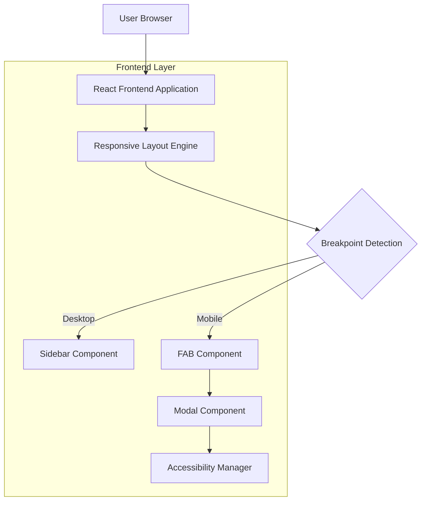

## 1. Architecture design



## 2. Technology Description
- Frontend: React@18 + tailwindcss@3 + vite
- Initialization Tool: vite-init
- Backend: None (integração com sistema existente)
- Dependencies Adicionais: lucide-react (ícones), framer-motion (animações)

## 3. Route definitions
| Route | Purpose |
|-------|---------|
| /maintenance | Página principal de manutenção, exibe formulário adaptativo |

## 4. Component Architecture

### 4.1 Core Components

**ResponsiveLayout Component**
```typescript
interface ResponsiveLayoutProps {
  children: React.ReactNode;
  breakpoint?: number;
}
```

**MaintenanceForm Component**
```typescript
interface MaintenanceFormProps {
  isModal?: boolean;
  onClose?: () => void;
}
```

**FloatingActionButton Component**
```typescript
interface FABProps {
  onClick: () => void;
  icon?: React.ReactNode;
  ariaLabel: string;
}
```

**Modal Component**
```typescript
interface ModalProps {
  isOpen: boolean;
  onClose: () => void;
  children: React.ReactNode;
  title?: string;
}
```

### 4.2 Responsive Utilities

**Breakpoint Hook**
```typescript
const useBreakpoint = () => {
  const [isMobile, setIsMobile] = useState(false);
  const [isTablet, setIsTablet] = useState(false);
  const [isDesktop, setIsDesktop] = useState(false);
  
  // Lógica de detecção de breakpoints
  return { isMobile, isTablet, isDesktop };
};
```

## 5. CSS Architecture

### 5.1 Media Queries
```css
/* Mobile First Approach */
@media (max-width: 768px) {
  .maintenance-sidebar {
    display: none;
  }
  
  .maintenance-fab {
    position: fixed;
    top: 1rem;
    right: 1rem;
    z-index: 50;
  }
  
  .modal-container {
    width: 90vw;
    max-width: 500px;
    max-height: 80vh;
  }
}

@media (min-width: 769px) and (max-width: 1024px) {
  .maintenance-sidebar {
    width: 280px;
  }
}

@media (min-width: 1025px) {
  .maintenance-sidebar {
    width: 320px;
  }
  
  .maintenance-fab {
    display: none;
  }
}
```

### 5.2 Animation Classes
```css
.modal-enter {
  opacity: 0;
  transform: scale(0.95);
}

.modal-enter-active {
  opacity: 1;
  transform: scale(1);
  transition: opacity 300ms, transform 300ms;
}

.modal-exit {
  opacity: 1;
  transform: scale(1);
}

.modal-exit-active {
  opacity: 0;
  transform: scale(0.95);
  transition: opacity 300ms, transform 300ms;
}
```

## 6. Accessibility Implementation

### 6.1 ARIA Attributes
```typescript
// FAB Button
<button
  aria-label="Abrir formulário de manutenção"
  aria-expanded={isModalOpen}
  aria-controls="maintenance-modal"
  role="button"
  tabIndex={0}
>

// Modal
<div
  role="dialog"
  aria-modal="true"
  aria-labelledby="modal-title"
  aria-describedby="modal-description"
  id="maintenance-modal"
>
```

### 6.2 Keyboard Navigation
```typescript
// Hook para gerenciar teclado
const useKeyboardNavigation = (onClose: () => void) => {
  useEffect(() => {
    const handleKeyDown = (event: KeyboardEvent) => {
      if (event.key === 'Escape') {
        onClose();
      }
      if (event.key === 'Tab') {
        // Implementar focus trap
      }
    };
    
    document.addEventListener('keydown', handleKeyDown);
    return () => document.removeEventListener('keydown', handleKeyDown);
  }, [onClose]);
};
```

## 7. Performance Considerations

### 7.1 Lazy Loading
- Modal carregado sob demanda
- Animações com requestAnimationFrame
- Debounce para resize events

### 7.2 Bundle Optimization
- Code splitting para componentes modais
- Tree shaking para CSS não utilizado
- Compressão de assets estáticos

## 8. Testing Strategy

### 8.1 Unit Tests
- Componentes responsivos
- Hooks de breakpoint
- Gerenciamento de estado do modal

### 8.2 Integration Tests
- Fluxo completo mobile/desktop
- Navegação por teclado
- Acessibilidade com screen readers

### 8.3 Visual Regression Tests
- Screenshots em múltiplos breakpoints
- Testes de animações
- Verificação de estados de focus