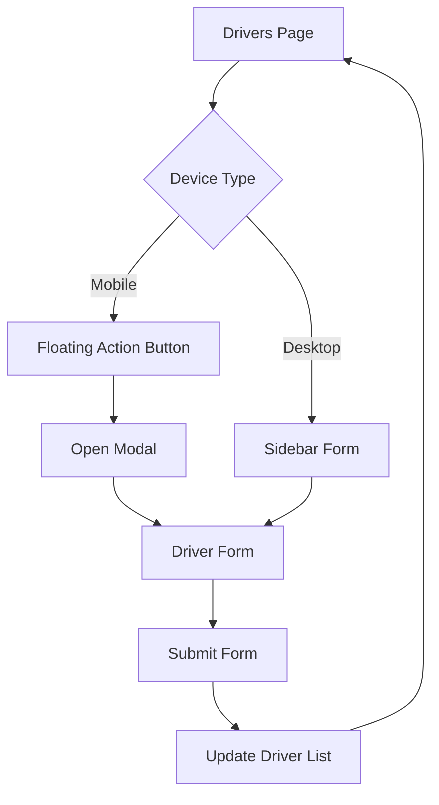

## 1. Product Overview
Transformação da página de drivers em um layout totalmente responsivo, garantindo experiência consistente em todos os dispositivos. O foco é adaptar o formulário de motorista para mobile através de um botão flutuante que abre modal, mantendo a sidebar no desktop.

## 2. Core Features

### 2.1 User Roles
| Role | Registration Method | Core Permissions |
|------|---------------------|------------------|
| Driver | Email/Social login | Cadastrar e gerenciar informações pessoais |
| Admin | Sistema interno | Visualizar e gerenciar todos os motoristas |

### 2.2 Feature Module
Página de Drivers com as seguintes funcionalidades:
1. **Lista de Drivers**: Visualização de motoristas cadastrados
2. **Formulário de Cadastro**: Adicionar novos motoristas
3. **Modal Responsivo**: Interface adaptativa para formulário em dispositivos móveis

### 2.3 Page Details
| Page Name | Module Name | Feature description |
|-----------|-------------|---------------------|
| Drivers Page | Driver List | Exibir lista de motoristas com informações básicas |
| Drivers Page | Floating Action Button | Botão flutuante no mobile (canto superior direito) que abre modal de cadastro |
| Drivers Page | Responsive Modal | Modal com animações fade-in/out, overlay escuro, botão fechar (X), acessível via ESC |
| Drivers Page | Desktop Sidebar | Manter sidebar fixa com formulário de cadastro em telas maiores |
| Drivers Page | Responsive Grid | Adaptar layout da lista de drivers para diferentes tamanhos de tela |

## 3. Core Process
### Fluxo de Usuário Mobile:
1. Usuário acessa página de drivers
2. Visualiza lista de motoristas
3. Clica no botão flutuante (+) no canto superior direito
4. Modal abre com formulário de cadastro
5. Preenche informações do motorista
6. Fecha modal (X, ESC ou clique no overlay)
7. Lista atualizada com novo motorista

### Fluxo de Usuário Desktop:
1. Usuário acessa página de drivers
2. Visualiza lista de motoristas e sidebar com formulário
3. Preenche formulário lateralmente
4. Submete formulário
5. Lista atualizada com novo motorista

## 4. User Interface Design

### 4.1 Design Style
- **Cores Primárias**: Azul profissional (#2563eb) para ações principais
- **Cores Secundárias**: Cinza neutro (#6b7280) para textos secundários
- **Botões**: Estilo arredondado com sombra sutil (shadow-md)
- **Tipografia**: Fonte sans-serif moderna, tamanhos responsivos
- **Ícones**: Material Design Icons para consistência
- **Animações**: Transições suaves (transition-all duration-300)

### 4.2 Page Design Overview
| Page Name | Module Name | UI Elements |
|-----------|-------------|-------------|
| Drivers Page | FAB Button | Botão circular flutuante, posicionado top-4 right-4, cor primária, ícone "+", shadow-lg |
| Drivers Page | Modal | Centralizado, max-width 95vw, max-height 90vh, border-radius 8px, overlay rgba(0,0,0,0.5) |
| Drivers Page | Modal Header | Título "Cadastrar Motorista", botão X no canto superior direito |
| Drivers Page | Form Container | Padding 24px, scroll vertical se necessário, campos empilhados verticalmente |
| Drivers Page | Driver List | Grid responsivo: 1 coluna (mobile), 2 colunas (tablet), 3 colunas (desktop) |

### 4.3 Responsiveness
- **Mobile-first approach**: Design base para telas pequenas (320px+)
- **Breakpoints**: 768px (tablet), 1024px (desktop)
- **Touch optimization**: Botões com mínimo 44px de altura, espaçamento adequado
- **Viewport meta tag**: width=device-width, initial-scale=1.0

### 4.4 Acessibilidade
- **ARIA Attributes**: aria-label no FAB, aria-labelledby no modal, aria-hidden no overlay
- **Navegação por teclado**: tabindex="0" em elementos interativos, focus visible
- **Fechamento ESC**: Event listener para keydown === 'Escape'
- **Focus trap**: Manter foco dentro do modal quando aberto
- **Screen reader**: Anúncios de estado (modal aberto/fechado)