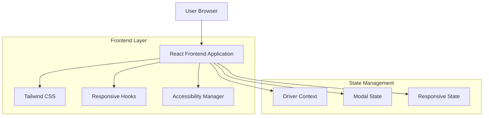

## 1. Architecture design



## 2. Technology Description
- Frontend: React@18 + tailwindcss@3 + vite
- Initialization Tool: vite-init
- Backend: None (frontend-only responsividade)
- Dependencies adicionais:
  - @headlessui/react (para modal acessível)
  - lucide-react (para ícones)
  - react-use (hooks utilitários)

## 3. Route definitions
| Route | Purpose |
|-------|---------|
| /drivers | Página principal de motoristas, lista e formulário |

## 4. Component Architecture

### 4.1 Core Components

**DriverList Component**
```typescript
interface Driver {
  id: string;
  name: string;
  license: string;
  phone: string;
  email: string;
  status: 'active' | 'inactive';
}

interface DriverListProps {
  drivers: Driver[];
  onDriverUpdate: () => void;
}
```

**DriverForm Component**
```typescript
interface DriverFormProps {
  onSubmit: (driver: Omit<Driver, 'id'>) => Promise<void>;
  initialData?: Driver;
}
```

**ResponsiveModal Component**
```typescript
interface ResponsiveModalProps {
  isOpen: boolean;
  onClose: () => void;
  title: string;
  children: React.ReactNode;
  size?: 'sm' | 'md' | 'lg' | 'xl';
}
```

**FloatingActionButton Component**
```typescript
interface FloatingActionButtonProps {
  onClick: () => void;
  icon: React.ReactNode;
  ariaLabel: string;
  position?: 'top-right' | 'bottom-right' | 'top-left' | 'bottom-left';
}
```

## 5. Media Queries Structure

```css
/* Mobile First Approach */
/* Base styles for mobile (default) */
.fab-button {
  position: fixed;
  top: 1rem;
  right: 1rem;
  z-index: 50;
}

/* Tablet styles */
@media (min-width: 768px) {
  .fab-button {
    display: none;
  }
  
  .sidebar-form {
    display: block;
    width: 320px;
  }
}

/* Desktop styles */
@media (min-width: 1024px) {
  .driver-grid {
    grid-template-columns: repeat(3, 1fr);
  }
}

/* Large desktop */
@media (min-width: 1280px) {
  .driver-grid {
    grid-template-columns: repeat(4, 1fr);
  }
}
```

## 6. Responsive Hook Implementation

```typescript
// hooks/useResponsive.ts
import { useState, useEffect } from 'react';

export const useResponsive = () => {
  const [isMobile, setIsMobile] = useState(false);
  const [isTablet, setIsTablet] = useState(false);
  const [isDesktop, setIsDesktop] = useState(false);

  useEffect(() => {
    const checkDevice = () => {
      const width = window.innerWidth;
      setIsMobile(width < 768);
      setIsTablet(width >= 768 && width < 1024);
      setIsDesktop(width >= 1024);
    };

    checkDevice();
    window.addEventListener('resize', checkDevice);
    return () => window.removeEventListener('resize', checkDevice);
  }, []);

  return { isMobile, isTablet, isDesktop };
};
```

## 7. Accessibility Implementation

```typescript
// hooks/useModalAccessibility.ts
export const useModalAccessibility = (isOpen: boolean, onClose: () => void) => {
  useEffect(() => {
    if (!isOpen) return;

    const handleEscape = (event: KeyboardEvent) => {
      if (event.key === 'Escape') {
        onClose();
      }
    };

    document.addEventListener('keydown', handleEscape);
    document.body.style.overflow = 'hidden';

    return () => {
      document.removeEventListener('keydown', handleEscape);
      document.body.style.overflow = 'unset';
    };
  }, [isOpen, onClose]);
};
```

## 8. Animation Configuration

```css
/* Modal animations */
.modal-enter {
  opacity: 0;
  transform: scale(0.9);
}

.modal-enter-active {
  opacity: 1;
  transform: scale(1);
  transition: opacity 300ms, transform 300ms;
}

.modal-exit {
  opacity: 1;
  transform: scale(1);
}

.modal-exit-active {
  opacity: 0;
  transform: scale(0.9);
  transition: opacity 300ms, transform 300ms;
}

/* Overlay animation */
.overlay-enter {
  opacity: 0;
}

.overlay-enter-active {
  opacity: 1;
  transition: opacity 300ms;
}

.overlay-exit {
  opacity: 1;
}

.overlay-exit-active {
  opacity: 0;
  transition: opacity 300ms;
}
```

## 9. Performance Considerations

- **Lazy loading**: Componentes modais carregados sob demanda
- **Memoization**: React.memo para componentes pesados
- **Debounced resize**: Otimização de event listeners
- **CSS containment**: isolate propriedade para modais
- **Virtual scrolling**: Para listas grandes de motoristas